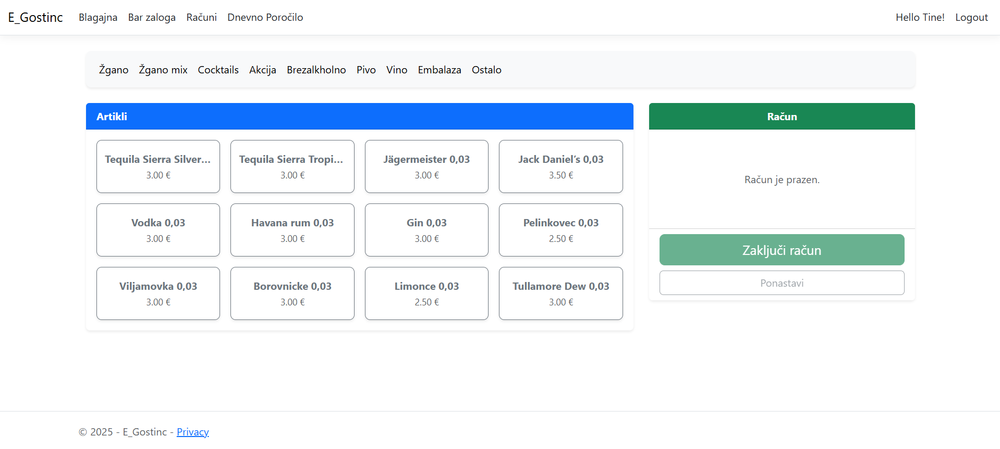
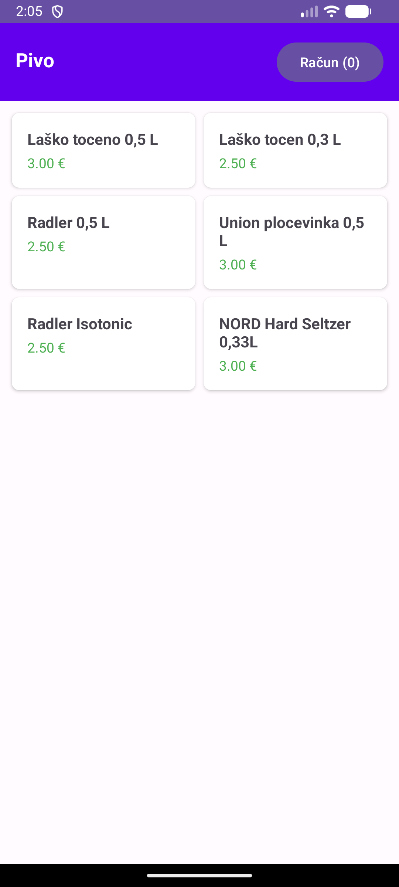
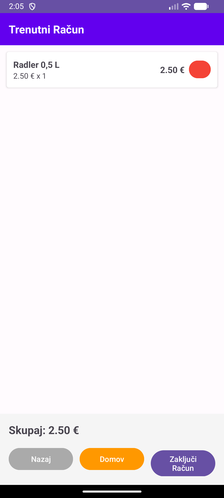
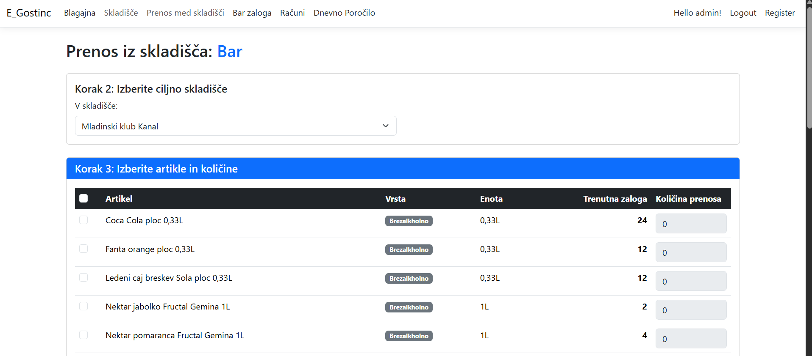
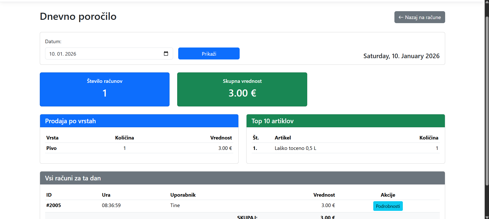
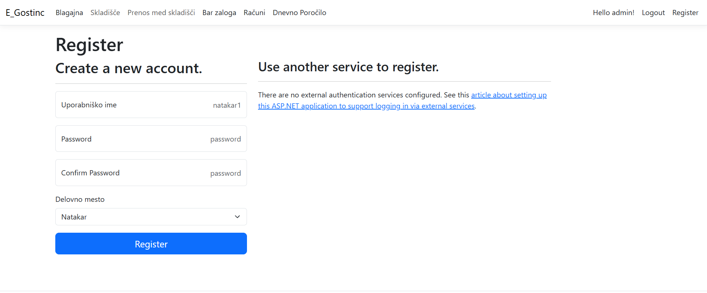
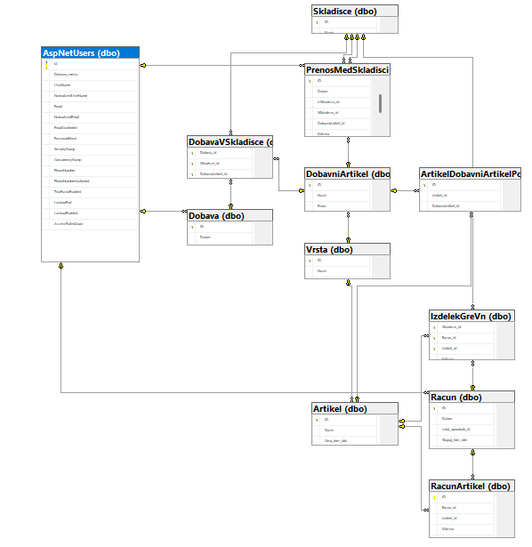

naslov projekta,
imena avtorjev z vpisnimi številkami,
zaslonske slike grafičnega vmesnika vaše mobilne aplikacije in spletne aplikacije (cca 5 zaslonskih slik vse skupaj),
kratek opis delovanja celotnega sistema
opis nalog, ki jih je izvedel vsak izmed študentov in
sliko podatkovnega modela podatkovne baze z opisom (diagram lahko zgradite z orodjem SQL Server Management Studio (SSMS)).
# E_Gostinc

Avtor: Tine Drekonja, 63240490

Project for FRI class Informacijski sistemi.

Spletna aplikacija omogoča izdajo računov, beleženje zalog v skladišču in pregled samih računov. Medtem ko mobilna aplikacija omogoča izdajo računov in pregled računov.

Registracija je možna le ko je uporabnik z admin vlogo prijavljen.

REST API omogoča:
- GET metode:
    - `/api/v1/artikel` - Seznam vseh artiklov
    - `/api/v1/vrsta` - Seznam vrst artiklov
    -`/api/v1/vrsta/{id}/artikli` - Artikli po vrstah
    - `/api/v1/racun/dnevni` - Dnevni računi
- POST metode:
    - `/api/v1/auth/login` - Prijava uporabnika
    - `/api/v1/racun` - Ustvarjanje novega računa

Swagger: https://egostinc-fca6f3f8cqh5fbhc.germanywestcentral-01.azurewebsites.net/swagger

Podatkovni model

slika

Opis tabel

Uporabnik (AspNetUsers)
- Id (PK) - ID uporabnika
- UserName - Uporabniško ime
- Delovno_mesto - Delovno mesto uporabnika

Artikel
- ID (PK) - ID artikla
- Naziv - Ime artikla
- Cena_brez_ddv - Cena, ki je ubistvu kar z ddv že vštetim
- VrstaID (FK) - Referenca na vrsto artikla

Vrsta
- ID (PK) - ID vrste
- Naziv - Ime vrste (Pivo, Vino, Brezalkoholno...)
- Davek - Davčna stopnja (%)

Racun
- ID (PK) - ID računa
- Datum - Datum izdaje
- Skupaj_brez_ddv - Skupni znesek brez DDV
- Skupaj_z_ddv - Skupni znesek z DDV
- Status - Status računa (Zakljucen, V_pripravi, storniran)
- Izdal_uporabnik_id (FK) - Uporabnik ki je izdal račun

IzdelekGreVn
- ID (PK)
- Racun_id (FK) - Referenca na račun
- Artikel_id (FK) - Referenca na artikel
- Skladisce_id (FK) - Skladišče iz katerega gre artikel
- Kolicina - Količina artikla

Skladisce
- ID (PK)
- Naziv - Ime skladišča (Bar, Kuhinja...)

DobavniArtikel
- ID (PK)
- Naziv - Ime dobavnega artikla
- Enota - Enota mere (kg, l, kos...)
- VrstaID (FK)

Dobava
- ID (PK)
- Datum_dobave - Datum dobave
- Prevzel_uporabnik_id (FK)

DobavaVSkladisce
- ID (PK)
- Dobava_id (FK)
- Skladisce_id (FK)
- DobavniArtikel_id (FK)
- Kolicina